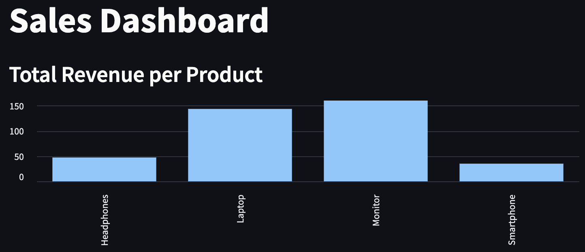

## Importing and Analyzing Parquet Files with DuckDB and Streamlit

This guide demonstrates how to create an interactive dashboard using DuckDB to analyze Parquet files with Streamlit. In this example, we'll create sales and product data Parquet files, read them using duckdb and perform SQL queries to calculate total revenue, best-selling products, and daily sales revenue, and visualize the results using Streamlit.
This setup doesnt need to have a distributed system rather use in memory processing to analyze and report the data.

### Prerequisites

Install the required packages:

```bash
pip install duckdb streamlit pandas pyarrow plotly
```

### Code Implementation

Here's how to create a sales analytics dashboard using DuckDB and Streamlit:

```python
import duckdb
import streamlit as st
import pandas as pd
import pyarrow as pa

# Create DuckDB connection
con = duckdb.connect()

# Read Parquet files directly using DuckDB
products_df = con.execute("""
    SELECT * from read_parquet('products.parquet')
""").df()

sales_df = con.execute("""
    SELECT * from read_parquet('sales.parquet')
""").df()

# Register DataFrames as tables
con.register("sales_table", sales_df)
con.register("products_table", products_df)

# Create Streamlit dashboard
st.title("Sales Dashboard")

# Query 1: Total Revenue per Product
query1 = con.execute("""
    SELECT 
        p.product_name, 
        SUM(s.quantity * s.price) AS total_revenue
    FROM sales_table s
    JOIN products_table p ON s.product_id = p.product_id
    GROUP BY p.product_name
    ORDER BY total_revenue DESC
""").df()

st.subheader("Total Revenue per Product")
st.bar_chart(query1.set_index("product_name"))

# Query 2: Best-Selling Product
query2 = con.execute("""
    SELECT 
        p.product_name, 
        SUM(s.quantity) AS total_quantity_sold
    FROM sales_table s
    JOIN products_table p ON s.product_id = p.product_id
    GROUP BY p.product_name
    ORDER BY total_quantity_sold DESC
    LIMIT 1
""").df()

st.subheader("Best-Selling Product")
st.write(query2)

# Query 3: Daily Sales Revenue
query3 = con.execute("""
    SELECT 
        sale_date, 
        SUM(quantity * price) AS daily_revenue
    FROM sales_table
    GROUP BY sale_date
    ORDER BY sale_date
""").df()

st.subheader("Daily Sales Revenue")
st.line_chart(query3.set_index("sale_date"))
```

### Key Features

1. Direct Parquet File Reading: DuckDB can read Parquet files directly without loading them into memory first.
2. SQL Queries: Complex analytics using standard SQL syntax.
3. Interactive Visualizations: Streamlit provides built-in chart components for data visualization.
4. Real-time Analysis: Dashboard updates automatically when data changes.

### Running the Dashboard

Execute the script and launch the Streamlit app:

```bash
streamlit run import_parquet.py
```
The dashboard will open in your default web browser, displaying:  
- Bar chart of revenue by product
- Best-selling product details
- Line chart of daily sales revenue

### Data Structure

This example uses two Parquet files with the following schemas:

1. `sales.parquet`:
```python
sales_data = {
    "sale_id": int,        # Unique identifier for each sale
    "product_id": int,     # References product_id in products table
    "quantity": int,       # Number of items sold
    "price": float,        # Price per unit
    "sale_date": datetime  # Date of sale
}
```

2. `products.parquet`:
```python
products_data = {
    "product_id": int,      # Unique identifier for each product
    "product_name": str,    # Name of the product
    "category": str,        # Product category
    "price": float         # Standard price
}
```
Example of creating sample data files:
```python
import pandas as pd
import os

# Create sales data
sales_data = {
    "sale_id": [1, 2, 3, 4, 5],
    "product_id": [101, 102, 101, 103, 104],
    "quantity": [2, 1, 5, 3, 4],
    "price": [20.5, 35.0, 20.5, 15.75, 40.0],
    "sale_date": pd.to_datetime([
        "2024-03-01", "2024-03-02", "2024-03-03", 
        "2024-03-04", "2024-03-05"
    ])
}
pd.DataFrame(sales_data).to_parquet("sales.parquet")

# Create products data
products_data = {
    "product_id": [101, 102, 103, 104],
    "product_name": ["Laptop", "Smartphone", "Headphones", "Monitor"],
    "category": ["Electronics", "Electronics", "Accessories", "Electronics"],
    "price": [1000.0, 500.0, 150.0, 300.0]
}
pd.DataFrame(products_data).to_parquet("products.parquet")
```

### Streamlit Dashboard


### Conclusion

This setup demonstrates the power of combining DuckDB with Streamlit for local analytics:
- Fast and efficient SQL analytics without a distributed system
- Direct Parquet file processing with minimal memory overhead
- Interactive visualizations through a user-friendly web interface
- Perfect for small to medium-sized datasets (up to several GBs)
- Zero-configuration analytics environment